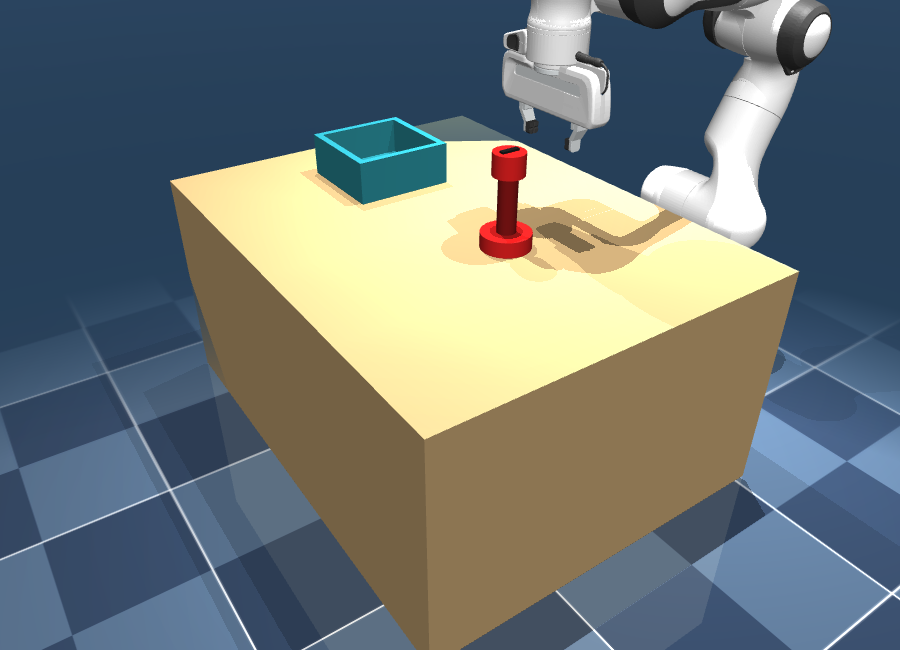
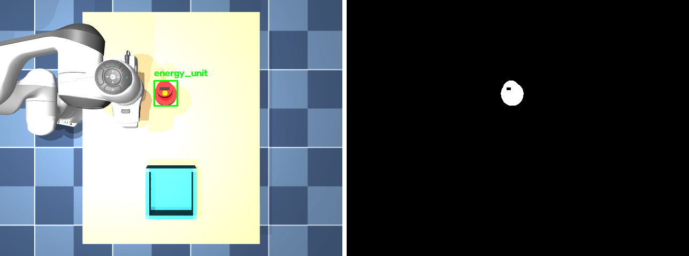
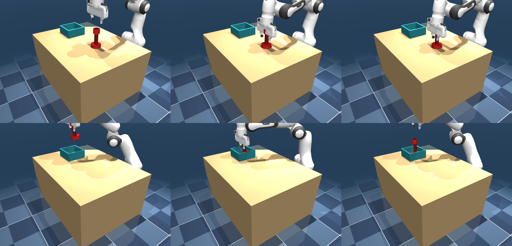

<a name="top"></a>
<h1 align="center">rm_arm_mujoco</h1>
<p align="center">
  <b>基于机器视觉引导的机械臂自动取放系统（MuJoCo 物理仿真）</b><br>
  <b>Vision-Guided Robotic-Arm Pick-and-Place in MuJoCo</b><br>
  <sub>面向 RoboMaster 2026 高校联盟赛工程挑战赛 · For the RoboMaster 2026 University League Engineering Challenge</sub>
</p>

<p align="center">
  
  
  
  
  
</p>

<p align="center">
  
</p>

<p align="center"><b><a href="#中文文档">🇨🇳 中文</a> ｜ <a href="#english">🇬🇧 English</a></b></p>

---

<a name="中文文档"></a>

## 中文文档

`rm_arm_mujoco` 是一个基于 [MuJoCo](https://mujoco.org/) 物理引擎、采用**仿真优先（simulation-first）**方法实现的**视觉引导机械臂自动取放**系统。任务参照 **RoboMaster 2026 高校联盟赛（RMUL）工程挑战赛**：机器人需抓取"能量单元"并放入目标受体。

系统用 RGB-D 相机感知目标、估计位姿，经逆运动学规划并执行平滑抓取轨迹，由有限状态机驱动"抓取 → 搬运 → 放置"全流程，闭合**感知—规划—控制**回路。核心价值在于：视觉感知让机械臂能对**位置发生变化**的目标在线自适应，而固定轨迹回放方案在此会失效。

> 配套实验报告（中文）见 [`docs/report.pdf`](docs/report.pdf)。

### ✨ 主要特性

- **RGB-D 感知**：离屏渲染 RGB + 深度图，由视场角解析内参，像素反投影 + 已知支撑平面的光线-平面定位。
- **颜色分割检测**：HSV 阈值分割 + 形态学 + 最大连通域质心（另附 ArUco / `solvePnP` 位姿估计作对照）。
- **手眼坐标变换**：清晰的 SE(3) 工具与 `world / base / camera / object / ee` 坐标系管理。
- **阻尼最小二乘（DLS）逆运动学**：基于 MuJoCo Jacobian，抗奇异、带关节限位。
- **平滑轨迹**：关节空间五次多项式插值与笛卡尔直线运动；手臂重力补偿消除稳态下垂。
- **有限状态机任务控制**：`SEARCH → APPROACH → DESCEND → GRASP → LIFT → MOVE → INSERT → RELEASE → RETREAT → DONE`，含失败重试。
- **可复现工具链**：[`uv`](https://docs.astral.sh/uv/) 管理环境、单元 + 集成测试、一键 demo、视频/配图录制、随机化基准测试。

### 🔬 方法

<p align="center">
</p>

```
RGB-D 相机 ─▶ 颜色检测 ─▶ 位姿估计 ─▶ 手眼坐标变换
                                           │
     关节伺服 ◀── DLS-IK ◀── 抓取与轨迹规划
                                           │
                              有限状态机（任务逻辑）
```

状态机驱动的取放流程：

<p align="center"></p>

<p align="center"><sub>
(a) 检测与对准 · (b) 下降抓取 · (c) 抬升搬运 · (d) 移动至目标 · (e) 插入放置 · (f) 松开撤离
</sub></p>

### 📊 实验结果

在 **20 次随机化实验**（能量单元初始位置在工作台上随机）下测得：

| 指标 | 结果 |
| :-- | :-- |
| 取放任务成功率 | **100%**（20/20） |
| 视觉定位误差（均值 / 最大） | 4.9 / 16.5 mm |
| 放置误差（均值 / 最大） | 20.9 / 43.0 mm |
| 单帧感知耗时（检测+位姿） | 约 0.6 ms |
| 单次任务耗时（仿真时间） | 约 6.7 s |
| 对目标位置扰动的鲁棒性 | 水平 ±100 mm 内 100% |

复现：`uv run python scripts/benchmark.py -n 20`

### 🚀 安装

需要 [`uv`](https://docs.astral.sh/uv/)。Franka Panda 模型（来自 [MuJoCo Menagerie](https://github.com/google-deepmind/mujoco_menagerie)）已随仓库提供于 `assets/robots/panda/`，无需额外下载。

```bash
git clone https://github.com/Functionhx/rm_arm_mujoco.git
cd rm_arm_mujoco
uv sync                     # 创建 .venv 并安装依赖
```

### 🕹️ 使用

```bash
uv run python scripts/run_demo.py         # 运行一次完整取放任务（无头）
uv run python scripts/view_live.py        # 实时窗口观看取放过程
uv run python scripts/record_demo.py      # 录制视频与配图到 outputs/
uv run python scripts/benchmark.py -n 20  # 随机化成功率基准测试

uv run python scripts/test_camera.py      # RGB-D 渲染 + 反投影校验
uv run python scripts/test_vision.py      # 检测 + 位姿估计校验
uv run python scripts/test_ik.py          # 逆运动学校验

uv run pytest                             # 单元 + 集成测试（10 个）
```

> **macOS 提示**：MuJoCo 原生 `launch_passive` viewer 需要 `mjpython`，与 uv 自带 Python 存在冲突。因此 `scripts/view_live.py` 改用普通 `uv run python` 即可弹出的 OpenCV 实时窗口。

### ⚙️ 配置

所有可调参数集中在 `configs/`（无需改代码）：

| 文件 | 内容 |
| :-- | :-- |
| `configs/sim.yaml`   | 场景路径、控制频率、相机与渲染参数 |
| `configs/robot.yaml` | 关节/执行器名、初始位姿、夹爪、IK 参数 |
| `configs/task.yaml`  | 抓取/放置物体、HSV 阈值、抓取/放置高度、状态机参数 |

### 📁 目录结构

```
rm_arm_mujoco/
├── configs/            # sim.yaml / robot.yaml / task.yaml
├── assets/
│   ├── robots/panda/   # Franka Panda（源自 MuJoCo Menagerie，Apache-2.0）
│   ├── objects/        # 能量单元 (cube.xml)、放置区 (tray.xml)
│   └── scenes/         # pick_place_scene.xml
├── src/
│   ├── sim/            # mujoco_env、camera(RGB-D)、recorder
│   ├── vision/         # color_detector、pose_estimator、aruco_pose
│   ├── geometry/       # transforms(SE3)、frames
│   ├── kinematics/     # 正/逆运动学、jacobian
│   ├── planning/       # grasp_planner、trajectory、collision_check
│   ├── control/        # arm_controller、gripper_controller
│   ├── task/           # state_machine、pick_place_task
│   └── utils/          # logger、debug_draw
├── scripts/            # run_demo、view_live、record_demo、benchmark、test_*
├── tests/              # test_transforms / test_kinematics / test_state_machine
└── docs/               # report.pdf、media/
```

### 📝 仿真代理说明

真实 RoboMaster 能量单元为 Ø95/Ø80 mm 的哑铃形，需由自制大夹爪抓取。为适配 **Franka Panda 夹爪 80 mm 行程**，仿真物体保持哑铃拓扑与 150 mm 总高，但将顶端盖缩为 Ø50、中间可夹持细腰设为 Ø30，使并联夹爪能自上而下夹持。该代理不影响对视觉引导取放**算法**的验证——算法在控制层面可迁移至真实机械臂。搬运时的夹持牢固性通过夹爪闭合时激活的焊接约束保证（等效牢固物理夹握）。详见报告。

### 📌 引用

```bibtex
@software{fan2026_rm_arm_mujoco,
  author  = {Fan, Yuchen},
  title   = {rm\_arm\_mujoco: Vision-Guided Robotic-Arm Pick-and-Place in MuJoCo},
  year    = {2026},
  url     = {https://github.com/Functionhx/rm_arm_mujoco}
}
```

### 🙏 致谢

- Google DeepMind 的 [MuJoCo](https://mujoco.org/) 与 [MuJoCo Menagerie](https://github.com/google-deepmind/mujoco_menagerie)（Franka Panda 模型）。
- 任务设定参考 **DJI RoboMaster 2026** 高校联盟赛工程挑战赛。

### 📄 许可证

采用 [MIT License](LICENSE)。随附的 Panda 模型遵循 Apache-2.0（见 `assets/robots/panda/LICENSE`）。

<p align="right"><a href="#top">⬆ 返回顶部</a></p>

---

<a name="english"></a>

## English

`rm_arm_mujoco` is a **simulation-first** implementation of a full vision-guided
manipulation pipeline for an automatic **pick-and-place** task, built on the
[MuJoCo](https://mujoco.org/) physics engine. The task is modeled after the
**RoboMaster 2026 University League (RMUL) Engineering Challenge**, in which a robot
must grasp an *energy unit* and place it into a target receptacle.

The system perceives the target with an RGB-D camera, estimates its pose, plans and
executes a smooth grasp trajectory via inverse kinematics, and drives the whole
pick → transport → place sequence with a finite-state machine — closing the loop
from **perception** to **planning** to **control**. The core value proposition is
that visual perception lets the arm *adapt online* to a target whose position varies,
where a fixed replay trajectory would fail.

> A companion experiment report (in Chinese) is included at
> [`docs/report.pdf`](docs/report.pdf).

### ✨ Key Features

- **RGB-D perception** — off-screen RGB + depth rendering, intrinsics from FoV, pixel
  back-projection and ray–plane localization on the known support plane.
- **Color-segmentation detection** — HSV thresholding + morphology + largest-contour
  centroid (with an optional ArUco/`solvePnP` pose estimator for comparison).
- **Hand–eye coordinate transforms** — clean SE(3) utilities and a frame manager for
  `world / base / camera / object / ee`.
- **Damped least-squares (DLS) inverse kinematics** — MuJoCo Jacobian, singularity-robust,
  joint-limit-aware.
- **Smooth trajectories** — quintic-polynomial joint interpolation and Cartesian
  straight-line motion; arm gravity compensation removes steady-state droop.
- **FSM task controller** — `SEARCH → APPROACH → DESCEND → GRASP → LIFT → MOVE →
  INSERT → RELEASE → RETREAT → DONE` with retries.
- **Reproducible tooling** — [`uv`](https://docs.astral.sh/uv/)-managed environment,
  unit + integration tests, one-command demo, video/figure recording, and a
  randomized benchmark harness.

### 🔬 Method

<p align="center">
</p>

```
RGB-D camera ─▶ color detection ─▶ pose estimation ─▶ hand-eye transform
                                                             │
       joint servo ◀── DLS-IK ◀── grasp & trajectory planning
                                                             │
                                          finite-state machine (task logic)
```

The pick-and-place sequence executed by the state machine:

<p align="center"></p>

<p align="center"><sub>
(a) detect &amp; align · (b) descend &amp; grasp · (c) lift · (d) move to target ·
(e) place · (f) release &amp; retreat
</sub></p>

### 📊 Results

Measured over **20 randomized trials** (object initial position randomized on the table):

| Metric | Result |
| :-- | :-- |
| Pick-and-place success rate | **100 %** (20/20) |
| Vision position error (mean / max) | 4.9 / 16.5 mm |
| Placement error (mean / max) | 20.9 / 43.0 mm |
| Perception time (detect + pose) | ~0.6 ms |
| Task duration (sim time) | ~6.7 s |
| Robustness to target displacement | 100 % within ±100 mm horizontal |

Reproduce with `uv run python scripts/benchmark.py -n 20`.

### 🚀 Installation

Requires [`uv`](https://docs.astral.sh/uv/). The Franka Panda model (from
[MuJoCo Menagerie](https://github.com/google-deepmind/mujoco_menagerie)) is vendored
under `assets/robots/panda/`, so no extra download is needed.

```bash
git clone https://github.com/Functionhx/rm_arm_mujoco.git
cd rm_arm_mujoco
uv sync                     # create .venv and install dependencies
```

### 🕹️ Usage

```bash
uv run python scripts/run_demo.py         # run one full pick-and-place task (headless)
uv run python scripts/view_live.py        # live OpenCV window of the task
uv run python scripts/record_demo.py      # record video + figures to outputs/
uv run python scripts/benchmark.py -n 20  # randomized success-rate benchmark

uv run python scripts/test_camera.py      # RGB-D render + back-projection check
uv run python scripts/test_vision.py      # detection + pose-estimation check
uv run python scripts/test_ik.py          # inverse-kinematics check

uv run pytest                             # unit + integration tests (10 tests)
```

> **macOS note:** MuJoCo's native `launch_passive` viewer requires `mjpython`, which
> conflicts with uv's bundled Python. `scripts/view_live.py` therefore uses a live
> OpenCV window that works under plain `uv run python`.

### ⚙️ Configuration

All tunables live in `configs/` (no code edits needed):

| File | Contents |
| :-- | :-- |
| `configs/sim.yaml`   | scene path, control frequency, camera & render settings |
| `configs/robot.yaml` | joint/actuator names, home pose, gripper, IK parameters |
| `configs/task.yaml`  | object/target bodies, HSV thresholds, grasp/place heights, FSM params |

### 📁 Repository Structure

```
rm_arm_mujoco/
├── configs/            # sim.yaml / robot.yaml / task.yaml
├── assets/
│   ├── robots/panda/   # Franka Panda (vendored from MuJoCo Menagerie, Apache-2.0)
│   ├── objects/        # energy_unit (cube.xml), tray.xml
│   └── scenes/         # pick_place_scene.xml
├── src/
│   ├── sim/            # mujoco_env, camera (RGB-D), recorder
│   ├── vision/         # color_detector, pose_estimator, aruco_pose
│   ├── geometry/       # transforms (SE3), frames
│   ├── kinematics/     # forward/inverse kinematics, jacobian
│   ├── planning/       # grasp_planner, trajectory, collision_check
│   ├── control/        # arm_controller, gripper_controller
│   ├── task/           # state_machine, pick_place_task
│   └── utils/          # logger, debug_draw
├── scripts/            # run_demo, view_live, record_demo, benchmark, test_*
├── tests/              # test_transforms / test_kinematics / test_state_machine
└── docs/               # report.pdf, media/
```

### 📝 Notes on the Simulation Proxy

The real RoboMaster energy unit is a Ø95/Ø80 mm dumbbell that would be grasped by a
custom large gripper. To match the **Franka Panda's 80 mm gripper stroke**, the
simulated object keeps the dumbbell topology and 150 mm height but uses a reduced top
cap (Ø50) and a graspable central waist (Ø30) so the parallel gripper can grasp it
top-down. This proxy does not affect validation of the vision-guided pick-and-place
*algorithms*, which transfer to a real arm at the control level. Grasp firmness during
transport is enforced by a weld equality activated on gripper close (equivalent to a
firm physical grip). See the report for details.

### 📌 Citation

```bibtex
@software{fan2026_rm_arm_mujoco,
  author  = {Fan, Yuchen},
  title   = {rm\_arm\_mujoco: Vision-Guided Robotic-Arm Pick-and-Place in MuJoCo},
  year    = {2026},
  url     = {https://github.com/Functionhx/rm_arm_mujoco}
}
```

### 🙏 Acknowledgements

- [MuJoCo](https://mujoco.org/) and [MuJoCo Menagerie](https://github.com/google-deepmind/mujoco_menagerie) (Franka Panda model) by Google DeepMind.
- Task setting inspired by the **DJI RoboMaster 2026** University League Engineering Challenge.

### 📄 License

Released under the [MIT License](LICENSE). The vendored Panda model is under Apache-2.0
(see `assets/robots/panda/LICENSE`).

<p align="right"><a href="#top">⬆ Back to top</a></p>
